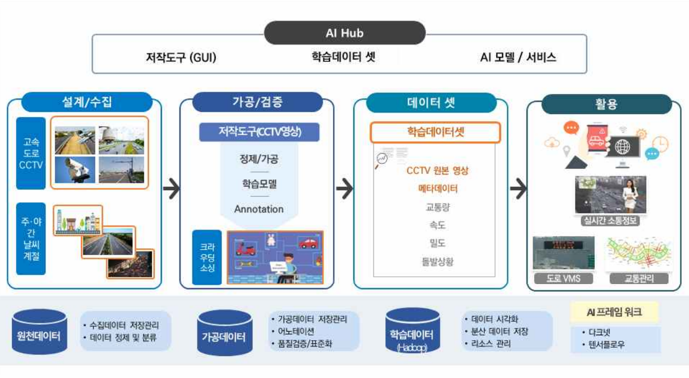

# [100] 교통문제 해결을 위한 CCTV 교통 데이터(고속도로) AI 모델

## 과제 개요

### 결과물

* 고속도로 CCTV 영상 50개, 500시간 이상 영상
* 차량 검출 30 만장, 차량 분할 20 만장 이미지(png) 및 어노테이션 파일(json)
* 속도 추정 GT 데이터로 사용하기 위한 VDS 영상 10시간

## 객체 검출, 분할 모델

본 과제에서 구축한 차량 검출, 분할 데이터셋 검증을 위해 객체 검출, 분할 모델을 사용
자세한 설명은 객체 검출, 분할 [README.md] 파일에서 확인할 수 있음
